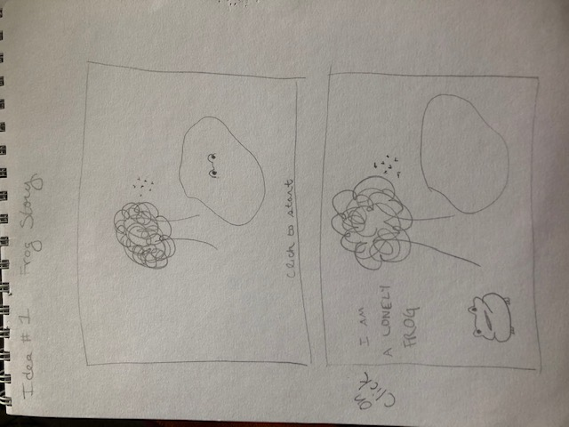
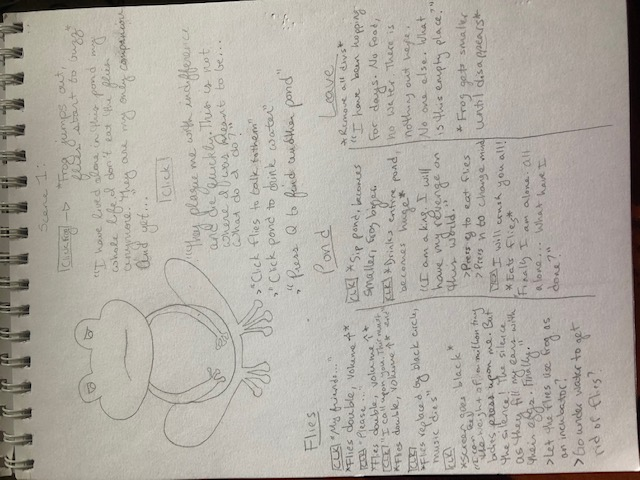

Frog Story

About this Game:
A choose-your-own-adventure style game about a frog that has lived alone in the same pond his whole life and is very tired. The game will start out with a frog in a pond, a tree, and some flies buzzing. Click the frog to start the game. There will be a few different options to choose the frog's future decisions (ex. eat the flies, find another pond). Some choices will keep the story moving, some choices will end the story and you lose.

Wireframe
 

MVP Checklist
-Get images onto screen and make them clickable
-Have at least two choices that the player can make to influence the story
-Have an end state if the player chooses a "bad" path
-Have an end state if the player works their way through the game with no "bad" paths
-Add fly buzzing sound
-Have a restart button

Stretch Goals
-Add animations
-Make it look the way I want
-Add different types of event listeners to make it more interactive
-Have the frog remember things you input like your name
-Have a "go back" button to redo a choice
-Add in several easter eggs/hidden elements
-Be able to control volume of fly buzzing sound

Tech Being Used
-HTML/CSS
-JavaScript
-Bootstrap

Credits:
Pond & Tree: 
<a href='https://www.freepik.com/free-photos-vectors/tree'>Tree vector created by brgfx - www.freepik.com</a>

Fly: 
<a href='https://www.freepik.com/free-photos-vectors/hand'>Hand vector created by freepik - www.freepik.com</a>

Fly Sounds:
https://www.youtube.com/watch?v=bcuKTheCcsE

Drink Sound:
http://soundbible.com/1527-Slurp.html